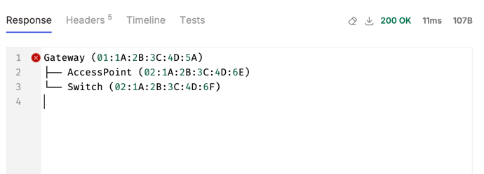

## Description 

A REST API based implementation of Network deployment that supports:
- Registering a network device deployment to network deployment
- Retrieving all registered devices, sorted by *networkDeviceDeployment type*
- Retrieving network device deployment by MAC address
- Retrieving all registered network network device deployment topology
- Retrieving network device deployment topology starting from a specific network device deployment

## How to run ? 

To run all tests:

```shell
./gradlew test
```

To run the application:

```shell
./gradlew bootRun
```

## API Description

### **/api/v1/network/deployments:** 

#### 1. Register a network device deployment to network deployment

**Curl example:**

```shell
curl --request POST \
  --url http://localhost:8080/api/v1/network/deployments \
  --header 'content-type: application/json' \
  --data '{
  "macAddress": "01:1A:2B:3C:4D:5A",
  "deviceType": "Gateway"
}'
```

Request payload example when no uplink address is specified:
```json
{
  "macAddress": "01:1A:2B:3C:4D:5A",
  "deviceType": "Gateway"
}
```

Request payload example when uplink address is specified:
```json
{
  "macAddress": "02:1A:2B:3C:4D:6F",
  "deviceType": "Switch",
  "uplinkMacAddress": "01:1A:2B:3C:4D:5A"  
}
```

Response example:
```json
{
  "macAddress": "02:1A:2B:3C:4D:6F",
  "deviceType": "Switch",
  "uplinkMacAddress": "01:1A:2B:3C:4D:5A"
}
```

#### 2. Retrieving all registered devices, sorted by *networkDeviceDeployment type*

N.B:  This API support pagination

**Curl example:**

```shell
curl --request GET \
  --url 'http://localhost:8080/api/v1/network/deployments?page=1&size=10'
```

**Response example:**

```json
{
  "data": [
    {
      "macAddress": "01:1A:2B:3C:4D:5A",
      "deviceType": "Gateway",
      "uplinkMacAddress": null
    },
    {
      "macAddress": "02:1A:2B:3C:4D:6F",
      "deviceType": "Switch",
      "uplinkMacAddress": "01:1A:2B:3C:4D:5A"
    }
  ],
  "currentPage": 1,
  "pageSize": 10,
  "totalRecords": 2,
  "totalPages": 1,
  "hasNextPage": false
}
```

### /api/v1/network/deployments/{macAddress}

**Retrieving network device deployment by MAC address**

**Curl example:**

```shell
curl --request GET \
  --url http://localhost:8080/api/v1/network/deployments/02:1A:2B:3C:4D:6F
```

**Response example:**
```json
{
  "macAddress": "02:1A:2B:3C:4D:6F",
  "deviceType": "Switch",
  "uplinkMacAddress": "01:1A:2B:3C:4D:5A"
}
```

### /api/v1/network/deployments/topology

**Retrieving all registered network network device deployment topology**

**Curl example:**

```shell
curl --request GET \
  --url http://localhost:8080/api/v1/network/deployments/topology
```

**Response example:**
```json
[
  {
    "macAddress": "01:1A:2B:3C:4D:5A",
    "deviceType": "Gateway",
    "uplinkMacAddress": null,
    "level": 1,
    "parentMacAddress": null
  },
  {
    "macAddress": "02:1A:2B:3C:4D:6F",
    "deviceType": "Switch",
    "uplinkMacAddress": "01:1A:2B:3C:4D:5A",
    "level": 2,
    "parentMacAddress": "01:1A:2B:3C:4D:5A"
  }
]
```

### /api/v1/network/deployments/topology/{macAddress}

Retrieving network device deployment topology starting from a specific network device deployment

**Curl example:**

```shell
curl --request GET \
  --url http://localhost:8080/api/v1/network/deployments/topology/01:1A:2B:3C:4D:5A
```

**Response example:**
```json
[
  {
    "macAddress": "01:1A:2B:3C:4D:5A",
    "deviceType": "Gateway",
    "uplinkMacAddress": null,
    "level": 1,
    "parentMacAddress": null
  },
  {
    "macAddress": "02:1A:2B:3C:4D:6F",
    "deviceType": "Switch",
    "uplinkMacAddress": "01:1A:2B:3C:4D:5A",
    "level": 2,
    "parentMacAddress": "01:1A:2B:3C:4D:5A"
  }
]
```

###  **/api/v1/visualization/network**

Rudimentary ascii visualization of network topology

**Curl example:**

```shell
curl --request POST \
  --url http://localhost:8080/api/v1/visualization/network/tree \
  --header 'content-type: application/json' \
  --data '[
  {
    "macAddress": "01:1A:2B:3C:4D:5A",
    "deviceType": "Gateway",
    "uplinkMacAddress": null,
    "level": 1,
    "parentMacAddress": null
  },
  {
    "macAddress": "02:1A:2B:3C:4D:6E",
    "deviceType": "AccessPoint",
    "uplinkMacAddress": "01:1A:2B:3C:4D:5A",
    "level": 2,
    "parentMacAddress": "01:1A:2B:3C:4D:5A"
  },
  {
    "macAddress": "02:1A:2B:3C:4D:6F",
    "deviceType": "Switch",
    "uplinkMacAddress": "01:1A:2B:3C:4D:5A",
    "level": 2,
    "parentMacAddress": "01:1A:2B:3C:4D:5A"
  }
]'
```

**Example visualization:**


## Approach

### Assumptions
- The API is meant for simple topologies. Currently the solution specifies a recursive depth of 256 by default (H2 database default). 
- There are no security requirements. 
- There are no containerization requirements. 
- The application should be self contained (gradle based) and should not require additional installations. 

The basic approach was to keep it simple and build a simple Controller-Service-Repository pattern based
implementation. The main choices made here:
- Use Springboot with jdbi. This was mainly to have customization ability on the SQl queries.
- Use in memory H2 database to keep it lightweight and simple.
- Leverage Common table expression to implement the tree based structure, representing a device deployment (This was tricky to get right).
- Use Flyway for database migration. 
- Uses Lombok for model definitions. 

## Alternatives considered
- Neo4j as the database of choice since it models trees/graphs more naturally. I have gone with the RDBMS based approach to keep it simple and not having to do 
  additional steps like installing/running the neo4j server (as per requirements).
- Mongo DB for similar reasons as above.

## Tested on
- Java 21
- SpringBoot
- H2
- Mac OS


